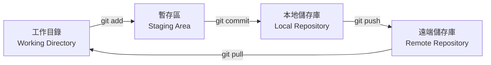
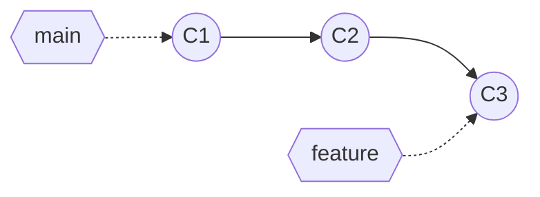
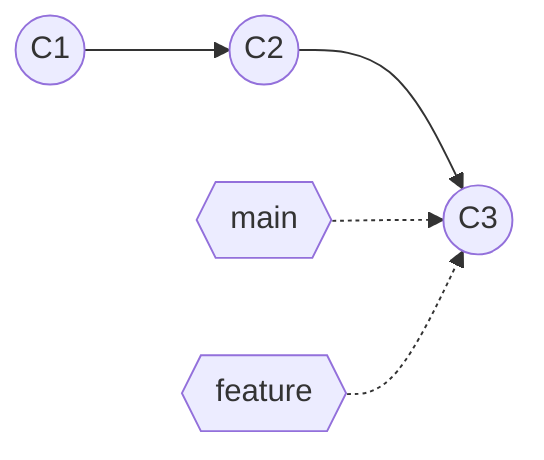
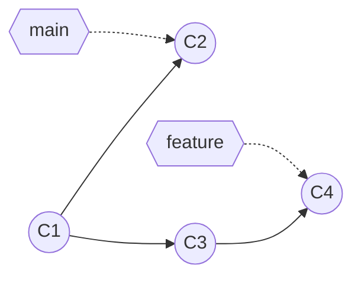
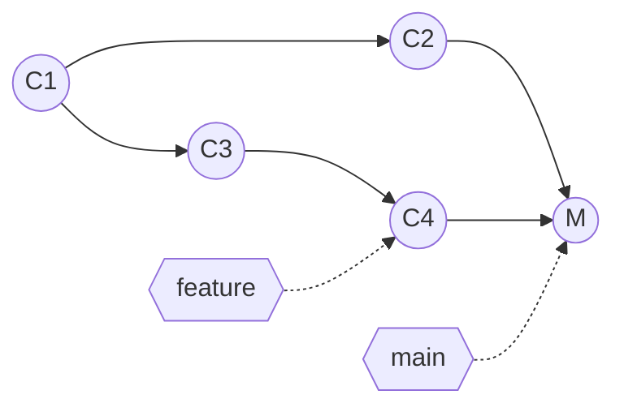

紀錄常見的 Git 指令：

## 本機指令

**cd**（chang directory）：指定下層資料夾位置。

**cd ..**：回到上層資料夾。

**mkdir**（make directory）：建立資料夾。

**rm**（remove file）：刪除檔案。

**rm -rf**：強制刪除資料夾（包含裡面檔案）。

**dir / ls** ：顯示資料夾內所有檔案。

**touch index.html**：建立檔案，index.html 可替換。

**code project**：打開指定 project。

**git config --global user .name "你的姓名"**：建立 git 創建人姓名。

**git config --global user . email "email"**：建立 git 創建人 email。

**git config --list**：查詢 git 資料。

**git --version**：git 版本。

**ctrl+L**：刪除指令碼，但能找出前面打的指令。

## 專案本地端指令

上傳流程圖：

**git init**：建立 .git 資料夾進行追蹤（.git資料夾是隱藏起來的）。

**git status**：git 狀態。

**git add index.html**：上傳單一檔案到 staging area.

**git add .** ：上傳全部檔案到 staging area。

**git add -u**：只上傳修改過的檔案到 staging area.

**git commit -m "填寫此版本資訊"**：commit 到 Local Repository。

**git log**：commit 的歷史。

**git reflog**：commit 的歷史（包含被 reset 過的檔案）。

**git reset HEAD^**：還原 commit 並將檔案退回到工作目錄，一個^代表退回一個，也可用數字 HEAD^2。

**git reset HEAD^ --hard**：還原 commit 並刪除檔案。

**git reset < commit 編號 > **：可以還原已被刪除的 commit。

**git branch**：查看分支。

**git branch name**：新增分支。

**git branch - < old name >< new name >**：更改分支名字。

**git checkout**：移動分支。

**git merge**：合併分支，有兩種情況。

1. 快轉分支（fast-forward）

分岔之後 main 沒有新的 commit，合併時只要把 main 的指標往前移到 feature 的位置就好，**不會產生新的 commit**。

合併前：

合併後：

2. 無快轉分支（non fast-forward）

分岔之後兩邊都有新的 commit，沒辦法只移動指標，git 會多產生一個 **merge commit** 把兩條線接起來。

合併前：

合併後：

## 專案遠端指令

**git remote**：查看遠端數據庫列表。

**git remote -v**：查看遠端數據庫列表（含 url）。

**git remote add \<遠端數據庫名稱\>\<遠端數據庫url\> **：建立遠端數據庫。

**git push origin** \<數據庫名稱，預設為 origin\>：上傳到遠端數據庫。

**git pull \<數據庫名稱\>\＜分支名稱\＞ **：下載同步更新本地數據庫。

**git clone "url"**：下載遠端數據庫。

## 參考

[Git 指令大全](https://mitblog.pixnet.net/blog/post/44380918)
[git cheat sheet](https://education.github.com/git-cheat-sheet-education.pdf)
